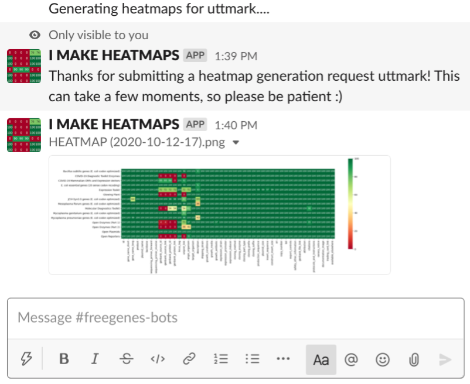
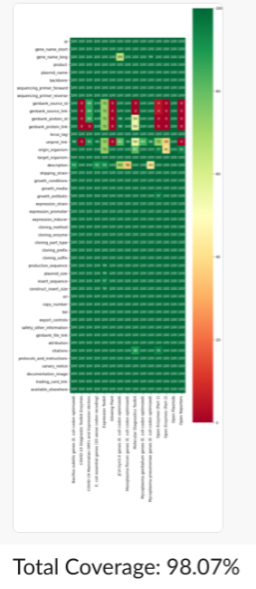
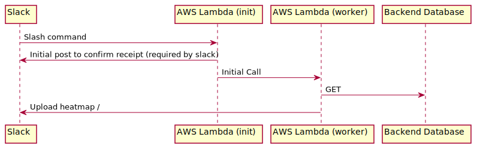
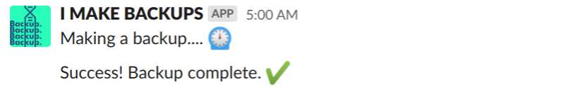
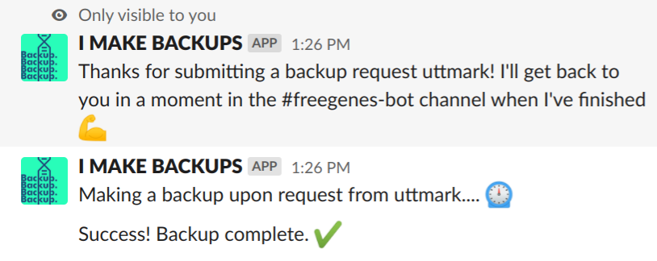
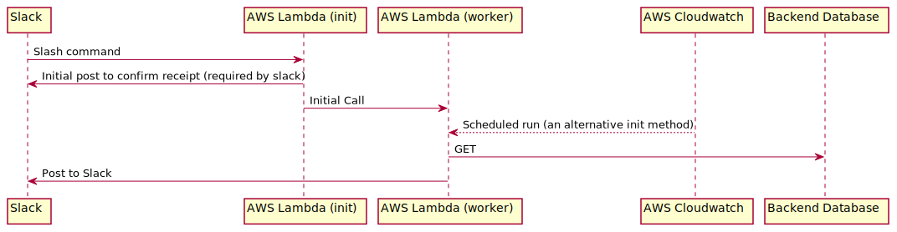
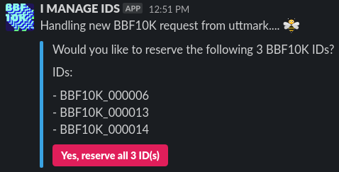
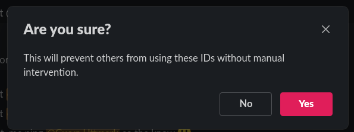
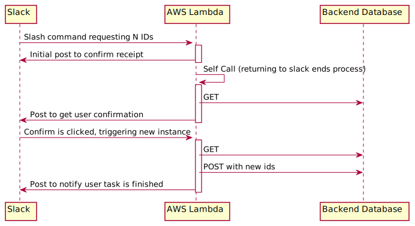

#Freegenes

> "We need your help. Tell us what useful DNA sequences should be developed for an open biotechnology commons and we will make them for you! What's the catch? Materials will be made available for you and others under the Unilateral OpenMTA so everyone can develop applications that benefit all people and the planet." - [stanford.freegenes.org](https://stanford.freegenes.org)

This repo powers [stanford.freegenes.org](stanford.freegenes.org). Data is stored in google sheets, user facing content in shopify and backups in AWS S3. Controls via slack commands.

## Sheets Backend

The backend database lives here: https://docs.google.com/spreadsheets/d/1LZCXzBtgey9xv5OH7YGYgp8UMJ27Eyj1aF9IhAW6M6o/edit?pli=1#gid=954552604

## Shopify <> Sheets Integration

`shopify-sheet-connector.py` does the following:

1. Pulls all shopify data via the [shopify python api](https://github.com/Shopify/shopify_python_api)
1. Pushes that data to the `Product Information` and `FedEx Info`sheets of the backend database
	- If content is longer than 50,000 chars, it's split into two columns
1. Columns are sorted alphebetically with the exception of the `title` and `handle` fields
1. Pulls the data stored in the `Packaging` and `Collections` sheets
1. Iterates through each product and searches for a match in `Packaging` and then sub-matches in `Collections` via the `id` and `composition_collections` columns respectively
1. Matches `Collections` to genes in the `Genes` sheet by the `composition_genes` and `id` columns respectively
1. Generates trading cards from each gene using a `genes-template.html` file (eg. a column `animal_type` would be used to fill any `{animal_value}` values found in `genes-tempalte.html`) and exports them to the `genes` directory
1. Generates gene tables found on the shopify product pages (replaces anything between `<!--START:GENES-->` and `<!--END:GENES-->`)
1. Generates canary notices and inserts them between `<!--START:CANARIA-->` and `<!--END:CANARIA-->`
1. Pushes edited product pages
1. Turns the host off (if the script dies, the EC2 instance *will not* turn itself off)

It's set to run on startup in an AWS EC2 instance. This instance can be brought up with the `/wizard`slack command. 

### Slack bots

#### "I MAKE HEATMAPS"

This bot makes heatmaps. Example:

These heatmaps are used to check the status of data in the [Google Sheets Backend](#sheets-backend). Data is grouped by product and is displayed as percent *not* blank (aka filled). Data that is counted as filled include `None`, `N/A` etc.

This bot is run by two AWS Lambda functions - one (`freegenes-heatmap-init`) handles slash commands (`/heatmap`) from slack and the other (`freegenes-heatmap`) actually makes the heatmap (this is due to slack wanting a quick return too it's messages).

The code of this bot lives [here](./code/slack-bots/heatmaps). It uses a layer stack that packages seaborn and google api tools which can be found [here](./code/slack-bots/layers/) (with some of scipy's c libraries removed due to space constraints).

#### "I MAKE BACKUPS"

This bot makes backups of the backend sheet.

This bot is run by two AWS Lambda functions - one (`freegenes-backup-init`) handles slash commands (`/backup`) from slack and the other (`freegenes-backup`) actually makes the backup (this is due to slack wanting a quick return too it's messages). The backup is saved as an `xlsx` excel file in an AWS S3 bucket (currently `freegenes-backups`) with a filename of `shopify-sheets.{timestamp}.{hash}.backup.xlsx` where `{timestamp}` is of the form `%Y-%m-%d_%H-%M-%S` (eg. `2020-01-29_13-30-30`) and `{hash}` is the first 8 chars of a sha1 hash (eg. `2b49af2d`). The `freegenes-backup` is run by an EventBridge recurring timer. At the time of writing, it's setup to run daily. Regardless of how the bot is triggered, it posts in the slack. 

If it's triggered by a slack slash command (`/backup`), it will post who requested the backup: (along with a nice message to the requester!)

#### "I MANAGE IDS"

This bot makes it easy to reserve the next available *N* BBF10K IDs. After typing `/get-ids N` (where N is an integer) into slack, a user will be given a list of IDs (derived from the `Genes` backend sheet) and asked for confirmation. If they confirm, the bot will add a new row to the bottom of the backend data base with an entry in `id` and `product` for each new ID. The product field is set to TBD with a note as to who reserved it and when.

On the backend, one lambda handles both requests: (1) when the user runs `/get-ids N` and (2) when the user clicks the button. The function is *not* running while it waits for user confirmation.

#### "I CRAWL LINKS"

WIP 

Written by Gwyn. They can be found at [gwynu.dev](http://gwynu.dev)
